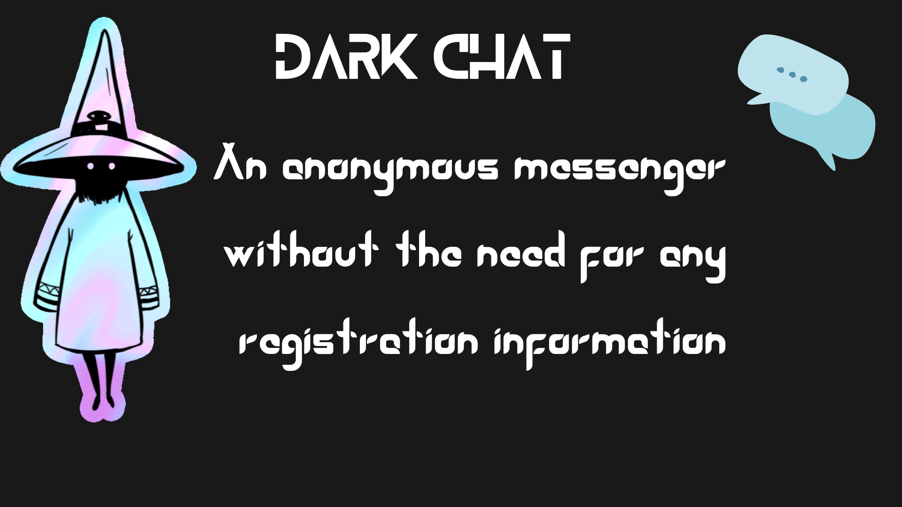

<p align="center">

</p>

# T-Dark-chat
An anonymous messenger without the need for any registration information


### What is Dark Chat?
DarkChat is an anonymous messenger with one-time accounts that you do not need any registration information to enter. 
<br>

In Dark Chat, you have usernames that are created randomly by the system itself and in 25 characters.
When you register in Dark Chat, you can specify the lifespan of your account from **1** to **24** hours. After this hour, your account will be lost.
<br>
You can change your username at any time during these hours, and if you are talking to someone, your conversation will be lost because your username will change and that person will not have your new username. 
<br>

Think of something like an **email** to understand more
<br>

### How to run this project?
```bash
git clone https://github.com/TorhamDev/T-Dark-chat.git

cd T-Dark-chat/

pip3 install -r requirement.txt

cd DarkChat/ 

python3 manage.py makemigrations

python3 manage.py migrate

python3 manage.py createsuperuser

python3 manage.py runserver

```